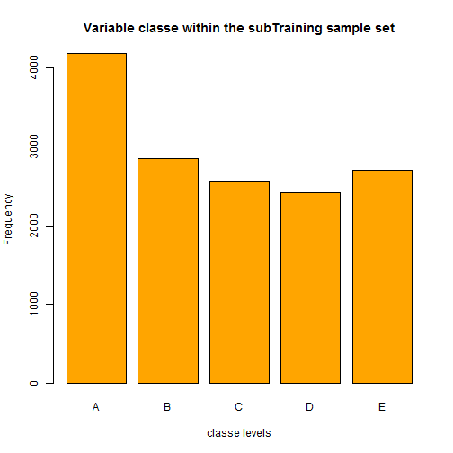
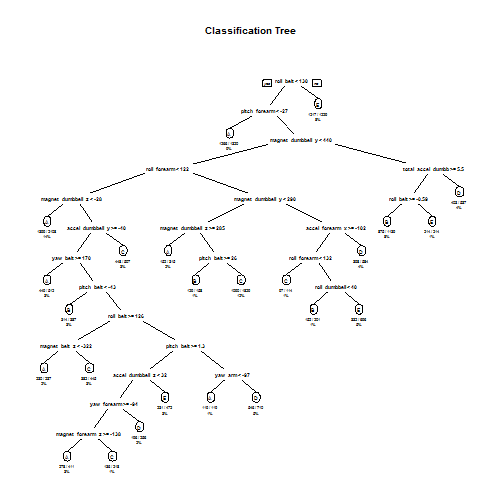

**Background**

The goal of this project is to predict the manner in which they did the exercise. This is the "classe" variable in the training set. The rest of the report will show how a model is built, how cross validation is used, what is the expected out of sample error, what and why are the choices are made. The prediction model will be used to predict 20 different test cases. 

**How you built your model**

The primary variable outcome is Classe which consists of levels - A, B, C, D, E. They reprensents weight lifting's level of condition during participants' exercise.
The training data set is large - 19622, which is capable to perform split into subtraining and subtesting data set.

Two models will be created with decision tree and random forest algorithm. Only the model with highest accuracy and least expected out of sample error will be chosen to have an efficient performance.


**Loading packages and get the data**

```r
library(caret)
library(randomForest)
library(rpart)
library(rpart.plot)
library(e1071) #having error of requireNamespaceQuietStop("e1071")

set.seed(8111)
# load and replace missing value with NA
get_training<-read.csv("C:/myR/Module 8/Data/pml-training.csv", na.strings = c("NA","#DIV/0!",""))
get_testing<-read.csv("C:/myR/Module 8/Data/pml-testing.csv", na.strings = c("NA","#DIV/0!",""))
```

**Preliminary understanding on data set**

```r
dim(get_training)
```

```
## [1] 19622   160
```

```r
dim(get_testing)
```

```
## [1]  20 160
```

**Getting the data clean**

Cleanse the column that is without value and unused columns

```r
get_training<-get_training[,colSums(is.na(get_training)) == 0]
get_testing <-get_testing[,colSums(is.na(get_testing)) == 0]
get_training<-get_training[,-c(1:7)]
get_testing<-get_testing[,-c(1:7)]
dim(get_training)
```

```
## [1] 19622    53
```

```r
dim(get_testing)
```

```
## [1] 20 53
```

**Cross-validation**

After unnecessary columns have been reduced, we'll now perform data partition for training data set.

Random split will be done on training data set with 75% on train_subTraining and 25% of train_subTesting. Predition model will be done on train_subTraining and test against train_subTesting data. Once we know which model delivers highest accuracy, it will be used to test againts get_testing data set.


Let's see what's the number of occurance in the "classe" variable of the subtraining sample set.

```r
plot(train_subTraining$classe, col="orange", main="Variable classe within the subTraining sample set", xlab="classe levels", ylab="Frequency")
```

 

From the plot, we can see that Classse A has the highest frequency, while Classe D has the least. 

**Prediction model with Decision Tree algorithm**

```r
model_dt <- rpart(classe ~ ., data=train_subTraining, method="class")
prediction_dt <- predict(model_dt, train_subTesting, type="class")
# create decision tree model plot
rpart.plot(model_dt, main="Classification Tree", extra=102, under=TRUE, faclen=0)
```

 

Test result against the subtesting data set

```r
confusionMatrix(prediction_dt, train_subTesting$classe)
```

```
## Confusion Matrix and Statistics
## 
##           Reference
## Prediction    A    B    C    D    E
##          A 1299  213   17   93   47
##          B   33  486   44   17   46
##          C   29   84  733  114  101
##          D   16   71   46  520   45
##          E   18   95   15   60  662
## 
## Overall Statistics
##                                           
##                Accuracy : 0.7545          
##                  95% CI : (0.7422, 0.7665)
##     No Information Rate : 0.2845          
##     P-Value [Acc > NIR] : < 2.2e-16       
##                                           
##                   Kappa : 0.6875          
##  Mcnemar's Test P-Value : < 2.2e-16       
## 
## Statistics by Class:
## 
##                      Class: A Class: B Class: C Class: D Class: E
## Sensitivity            0.9312   0.5121   0.8573   0.6468   0.7347
## Specificity            0.8946   0.9646   0.9190   0.9566   0.9530
## Pos Pred Value         0.7783   0.7764   0.6909   0.7450   0.7788
## Neg Pred Value         0.9703   0.8918   0.9683   0.9325   0.9410
## Prevalence             0.2845   0.1935   0.1743   0.1639   0.1837
## Detection Rate         0.2649   0.0991   0.1495   0.1060   0.1350
## Detection Prevalence   0.3403   0.1277   0.2164   0.1423   0.1733
## Balanced Accuracy      0.9129   0.7384   0.8882   0.8017   0.8439
```
**Expected out of sample error**

Expected out of sample error is 1 - accuracy from the cross validation data. 

As we can see, the above model has only 0.7545 accuracy, with 0.2455 of expected out of sample error.

Prediction model with Random Forest algorithm

```r
model_rf <- randomForest(classe ~. , data=train_subTraining, method="class")
prediction_rf <- predict(model_rf, train_subTesting, type="class")
# Test result against the subtesting data set
confusionMatrix(prediction_rf, train_subTesting$classe)
```

```
## Confusion Matrix and Statistics
## 
##           Reference
## Prediction    A    B    C    D    E
##          A 1395    5    0    0    0
##          B    0  944    2    0    0
##          C    0    0  853    7    0
##          D    0    0    0  795    2
##          E    0    0    0    2  899
## 
## Overall Statistics
##                                           
##                Accuracy : 0.9963          
##                  95% CI : (0.9942, 0.9978)
##     No Information Rate : 0.2845          
##     P-Value [Acc > NIR] : < 2.2e-16       
##                                           
##                   Kappa : 0.9954          
##  Mcnemar's Test P-Value : NA              
## 
## Statistics by Class:
## 
##                      Class: A Class: B Class: C Class: D Class: E
## Sensitivity            1.0000   0.9947   0.9977   0.9888   0.9978
## Specificity            0.9986   0.9995   0.9983   0.9995   0.9995
## Pos Pred Value         0.9964   0.9979   0.9919   0.9975   0.9978
## Neg Pred Value         1.0000   0.9987   0.9995   0.9978   0.9995
## Prevalence             0.2845   0.1935   0.1743   0.1639   0.1837
## Detection Rate         0.2845   0.1925   0.1739   0.1621   0.1833
## Detection Prevalence   0.2855   0.1929   0.1754   0.1625   0.1837
## Balanced Accuracy      0.9993   0.9971   0.9980   0.9942   0.9986
```
Random forest is able to produce 0.9963 accuracy of prediction. The expected out of sample error of Random Forest model is just 0.0037. That said, it performs better than Decision Tree and we'll have very few or none of test samples will be misclassified. So, random forest prediction algorithm is chosen.

Let's see what's the final outcome result with Random Forest prediction algorithm

```r
model_final <- randomForest(classe ~. , data=get_training, method="class")
predictfinal<- predict(model_final, get_testing, type="class")
predictfinal
```

```
##  1  2  3  4  5  6  7  8  9 10 11 12 13 14 15 16 17 18 19 20 
##  B  A  B  A  A  E  D  B  A  A  B  C  B  A  E  E  A  B  B  B 
## Levels: A B C D E
```

Write the 20 cases into a file for submission

```r
pml_write_files = function(x){
  n = length(x)
  for(i in 1:n){
    filename = paste0("problem_id_",i,".txt")
    write.table(x[i],file=filename,quote=FALSE,row.names=FALSE,col.names=FALSE)
  }
}
pml_write_files(predictfinal)
```

